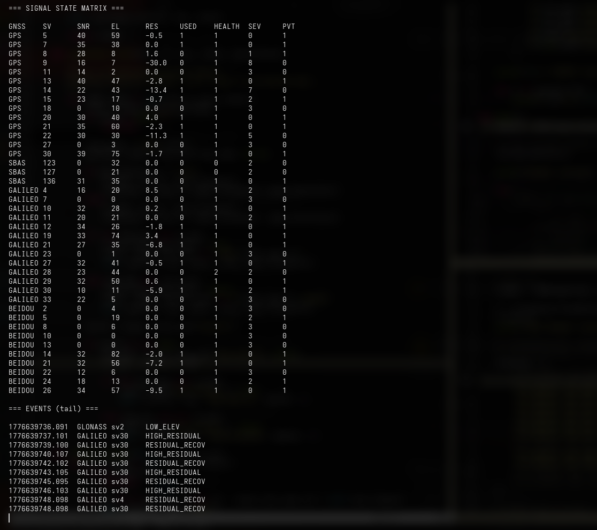

# RIME – GNSS Robustness and Integrity Monitoring Engine

RIME is an off-device processing layer for GNSS receivers (u-blox F9P) that evaluates signal robustness and basic integrity in real time. It parses UBX messages and produces a per-signal recommendation on whether a satellite should be used in PVT.




## Features

- Per-satellite tracking
- Metrics: SNR (C/N0), elevation, health, pseudorange residual (`prRes`)
- Threshold + hysteresis logic
- Event log (ACQUIRED, LOST, LOW_SNR, etc.)
- Per-signal PVT inclusion flag

## Usage

```bash
git clone <repo>
cd <repo>

python -m venv venv
source venv/bin/activate

pip install -r requirements.txt

python -m scripts.runtime
```

###Displays:
- live signal table
- PVT recommendation column
- event log

### Dependencies
See requirements.txt.
- pyubx2
- RTKLIB

### Disclaimer

No guarantee of correctness. Not intended for safety-critical use.
